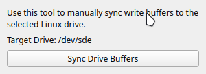

<div align="center">


# JustDD - USB Image Writer

</div>

JustDD is a simple, open-source graphical tool to write Linux and Windows ISO images to USB drives. It is designed for ease of use, safety, and flexibility, supporting both direct ISO writing (via `dd`) and advanced Windows USB preparation.

## ✨ Features

- **Write Linux ISOs** to USB drives using `dd` with progress reporting
- **Prepare Windows USB installers** with proper partitioning (FAT32/NTFS), file copying, and boot support
- **Manual Sync Tool**: Flush filesystem buffers to ensure data integrity
- **Drive detection**: Lists only removable drives for safety
- **Tabbed interface**: Separate workflows for Linux and Windows ISOs
- **Status output**: Real-time command output and progress
- **Root privilege handling**: Uses `pkexec` for safe privilege escalation
- **Open source**: GPLv3 license

## 📷 Screenshots




## 🚀 Usage

1. **Run the app** (requires root privileges):  
   
   First, install `uv` package manager:
   
   Arch Linux:
   ```bash
   yay -S python-uv
   ```
   
   Other distributions:
   ```bash
   curl -LsSf https://astral.sh/uv/install.sh | sh
   ```

   Clone the repository and install dependencies:
   ```bash
   git clone https://github.com/xxanqw/justdd.git
   cd justdd
   uv venv
   source ./.venv/bin/activate
   uv sync
   ```
   
   Launch the application:
   ```bash
   python app.py
   ```

2. **Linux ISO Tab**:
   - Click "Browse..." to select your ISO
   - Select your target USB drive
   - Click "Write to Drive" and confirm

3. **Windows ISO Tab**:
   - Click "Browse..." to select a Windows ISO
   - Select your target USB drive
   - Click "Prepare USB" and confirm

4. **Sync Tool**:
   - Use the "Sync Tool" button to manually flush write buffers to the selected drive

## 📋 Requirements

- Python 3.9 or newer
- [PySide6](https://pypi.org/project/PySide6/)
- Linux system with the following tools installed:
  - `dd`, `lsblk`, `parted`, `mkfs.vfat`, `mkfs.ntfs`
  - `rsync`, `mount`, `umount`, `wipefs`, `pkexec`

## 🔨 Building

To build a standalone executable, Nuitka is used. The package is included as a dev dependency.

### Install build dependencies:
```bash
uv sync --all-extras
```

### Build the executable:
```bash
uv run pyinstaller --onefile --add-data "images/icon.png:images" --name justdd app.py && mv dist/justdd ./
```

This creates a single executable file that includes all dependencies and can be distributed without requiring Python installation.

## 🔒 Security

- **Root required**: The app uses `pkexec` to safely request root privileges for drive operations
- **Drive safety**: Only removable drives are listed. Always double-check your target drive before writing!

## 🔗 Links

- [GitHub Repository](https://github.com/xxanqw/justdd)
