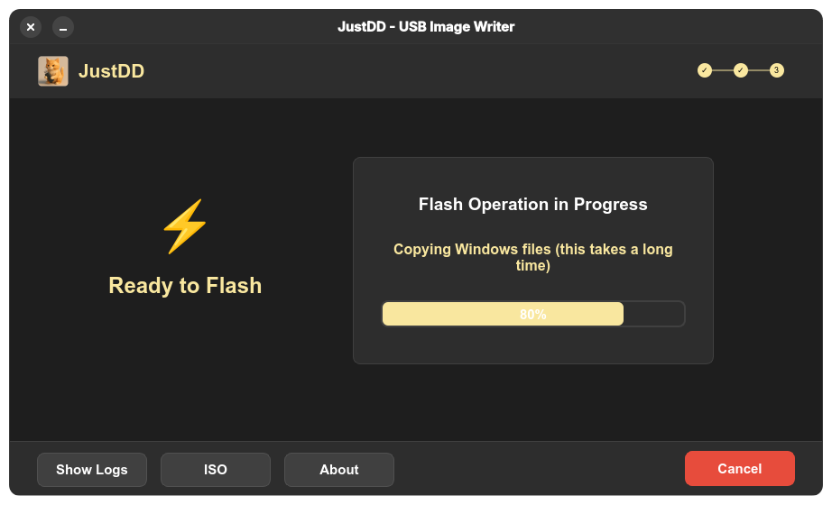
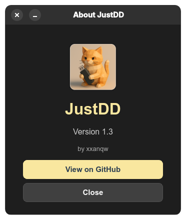

<div align="center">


# JustDD - USB Image Writer

[](https://github.com/xxanqw/justdd/actions/workflows/arch-package.yml)
[](https://github.com/xxanqw/justdd/actions/workflows/debian-package.yml)
[](https://github.com/xxanqw/justdd/actions/workflows/fedora-package.yml)
[](https://aur.archlinux.org/packages/justdd)
[](https://github.com/xxanqw/justdd/releases/latest)
[](https://www.python.org/downloads/)
[](LICENSE)

</div>

**JustDD** is a modern, cross-platform USB image writer with an intuitive wizard-style interface inspired by Balena Etcher. Designed for both beginners and power users, JustDD provides a safe, step-by-step process for creating Linux live USBs and Windows installer drives.

🎯 **Perfect for:**

- System administrators managing multiple OS installations
- Linux enthusiasts trying new distributions
- IT professionals preparing recovery media
- Anyone who needs reliable USB image writing with a guided interface

## ✨ Features

### 🧙‍♂️ Three-Step Wizard Interface

- **Step 1 - Select Image**: Browse and choose your ISO file with automatic OS detection
- **Step 2 - Choose Drive**: Pick your target USB drive from detected removable devices
- **Step 3 - Flash**: Review settings and write your image with real-time progress
- **Visual progress indicator**: Clean step indicator shows your current position
- **Smart navigation**: Back/Continue buttons guide you through the process

### 🔍 Intelligent ISO Detection

- **Automatic OS type detection**: Recognizes Linux distributions and Windows versions
- **Distribution identification**: Detects Ubuntu, Fedora, Debian, Arch, and more
- **Version parsing**: Extracts version information from filenames
- **File size display**: Shows human-readable file sizes
- **Real-time validation**: Instant feedback on ISO selection

### 🐧 Linux ISO Support

- **Direct `dd` writing** with real-time progress tracking
- **Optimized block size** (4MB) for faster writing
- **Status monitoring** with detailed command output
- **Automatic syncing** ensures complete data transfer
- **Safe device detection** prevents accidental system drive overwrites

### 🪟 Windows USB Preparation

- **Intelligent dual-partition setup** (FAT32 boot + NTFS install)
- **GPT partition table** for modern UEFI systems
- **Automatic file splitting** handles large install.wim files
- **Boot sector configuration** for maximum compatibility
- **Progress tracking** through each preparation stage

### 🛡️ Safety & Security

- **Removable drive detection**: Only shows USB/removable drives
- **Multiple confirmations**: Warning dialogs prevent accidents
- **Privilege escalation**: Secure `pkexec` integration
- **Process isolation**: Safe command execution with error handling
- **Graceful cancellation**: Stop operations safely at any time

### 🎨 Modern User Experience

- **Dark theme**: Professional appearance with golden accents
- **Responsive layout**: Adapts to different screen sizes
- **Visual feedback**: Icons and colors guide user actions
- **Comprehensive logging**: Built-in log viewer for troubleshooting
- **Additional tools**: ISO downloader and system information

## 📷 Screenshots

<div align="center">
    
    
    
    
    
    
    
    
</div>

## 🚀 Quick Start

### 📦 Installation

<details>
<summary><b>🏛️ Arch Linux (Recommended)</b></summary>

```bash
# Using yay (AUR helper)
yay -S justdd

# Or using paru
paru -S justdd

# Manual AUR installation
git clone https://aur.archlinux.org/justdd.git
cd justdd
makepkg -si
```

</details>

<details>
<summary><b>📦 Debian/Ubuntu</b></summary>

Download the latest `.deb` package from the [releases page](https://github.com/xxanqw/justdd/releases/latest):

```bash
# Download and install
wget https://github.com/xxanqw/justdd/releases/latest/download/justdd_*.deb
sudo dpkg -i justdd_*.deb

# Fix dependencies if needed
sudo apt-get install -f
```

**Dependencies included:** `ntfs-3g`, `parted`, `rsync`, and other required tools.

</details>

<details>
<summary><b>🎩 Fedora/CentOS/RHEL</b></summary>

Download the latest `.rpm` package from the [releases page](https://github.com/xxanqw/justdd/releases/latest):

```bash
# Download and install
wget https://github.com/xxanqw/justdd/releases/latest/download/justdd-*.rpm
sudo rpm -i justdd-*.rpm

# Or using dnf
sudo dnf install justdd-*.rpm
```

</details>

<details>
<summary><b>🔧 Other Distributions (From Source)</b></summary>

**Prerequisites:**

- Python 3.9+
- Git
- UV package manager

```bash
# Install UV package manager
curl -LsSf https://astral.sh/uv/install.sh | sh
source ~/.bashrc

# Clone and setup
git clone https://github.com/xxanqw/justdd.git
cd justdd
uv venv
source .venv/bin/activate
uv sync

# Launch JustDD
python app.py
```

</details>

### 🎯 Basic Usage

**📁 Step 1 - Select Image:**

1. Launch JustDD - you'll see the image selection page
2. Click **"Browse for Image"** to select your ISO file
3. JustDD automatically detects if it's Linux or Windows
4. See file size and distribution information displayed
5. Click **"Continue"** to proceed

**💾 Step 2 - Choose Drive:**

1. Review the list of available USB drives
2. Click **"🔄 Refresh"** if your drive isn't visible
3. Select your target drive from the list
4. Drive information (size, model) is displayed
5. Click **"Continue"** when ready

**⚡ Step 3 - Flash:**

1. Review the flash summary showing your selections
2. Read the warning about data loss carefully
3. Click **"Flash!"** to begin the operation
4. Monitor real-time progress and status updates
5. Wait for completion - don't interrupt the process!

**🎉 Success:**

- See confirmation of successful flash operation
- Click **"Flash Another Image"** to start over
- Your bootable USB is ready to use!

**🔧 Additional Features:**

- **Show Logs**: View detailed operation logs and troubleshooting info
- **ISO**: Access the built-in ISO downloader for Linux distributions
- **About**: View version information and credits

## 📋 System Requirements

### Minimum Requirements

- **OS**: Linux (any modern distribution)
- **Python**: 3.9 or newer
- **RAM**: 512 MB available
- **Storage**: 100 MB free space
- **Privileges**: Ability to run `pkexec`

### Required System Tools

JustDD requires these command-line tools (usually pre-installed):

| Tool             | Purpose                      | Usually found in |
| ---------------- | ---------------------------- | ---------------- |
| `dd`             | Raw disk writing             | `coreutils`      |
| `lsblk`          | Block device listing         | `util-linux`     |
| `parted`         | Disk partitioning            | `parted`         |
| `mkfs.vfat`      | FAT32 formatting             | `dosfstools`     |
| `mkfs.ntfs`      | NTFS formatting              | `ntfs-3g`        |
| `rsync`          | File synchronization         | `rsync`          |
| `mount`/`umount` | Filesystem mounting          | `util-linux`     |
| `wipefs`         | Filesystem signature removal | `util-linux`     |
| `pkexec`         | Privilege escalation         | `polkit`         |

### Python Dependencies

- **PySide6**: Qt6 bindings for Python
- **requests**: HTTP library for ISO downloads
- **beautifulsoup4**: HTML parsing for distribution websites

> **📝 Note**: Package installations automatically handle all dependencies.

## 🔨 Development & Building

### Development Setup

```bash
# Clone the repository
git clone https://github.com/xxanqw/justdd.git
cd justdd

# Setup development environment
uv venv
source .venv/bin/activate
uv sync

# Run in development mode
python app.py
```

### Building Standalone Executable

JustDD uses PyInstaller to create portable executables:

```bash
# Install build dependencies
uv sync --all-extras

# Build single-file executable
uv run pyinstaller --onefile \
    --add-data "images/icon.png:images" \
    --name justdd \
    app.py

# Move executable to project root
mv dist/justdd ./

# The executable is now ready for distribution
./justdd
```

### Building Packages

<details>
<summary><b>🏛️ Building Arch Package</b></summary>

```bash
# Update PKGBUILD version if needed
makepkg -si

# Or for AUR submission
makepkg --printsrcinfo > .SRCINFO
```

</details>

<details>
<summary><b>📦 Building Debian Package</b></summary>

```bash
# Debian packaging requires manual setup
# Create debian/ directory structure and build with debuild
# See Debian packaging documentation for details
```

</details>

<details>
<summary><b>🎩 Building RPM Package</b></summary>

```bash
# RPM packaging requires manual setup
# Create .spec file and build with rpmbuild
# See RPM packaging documentation for details
```

</details>

## 🔒 Security & Safety

### Security Model

- **Privilege Separation**: JustDD runs as a regular user and only elevates privileges for specific disk operations
- **Safe Command Execution**: All system commands are carefully validated and sanitized
- **Drive Detection**: Only removable drives are shown to prevent accidental system drive overwrites
- **Confirmation Dialogs**: Multiple confirmation steps before any destructive operations
- **Process Monitoring**: Real-time command output and error handling

### Best Practices

- **⚠️ Always verify your target drive** before flashing - data will be permanently lost
- **🔌 Use quality USB drives** for better reliability and performance
- **💾 Backup important data** before any disk operations
- **🔄 Verify your ISOs** using checksums when available
- **⏹️ Don't interrupt** the flashing process to avoid corrupted drives
- **🖥️ Check logs** if something goes wrong - detailed information is available

### Permissions Required

JustDD requires elevated privileges for:

- Reading/writing raw block devices (`/dev/sdX`)
- Mounting and unmounting filesystems
- Creating and modifying partition tables
- Formatting filesystems

**Why `pkexec`?**

- More secure than `sudo` for GUI applications
- Provides better user feedback and authentication dialogs
- Follows modern Linux security best practices
- Can be configured via PolicyKit rules

## 🛠️ Wizard Interface Details

### Step Indicator

The compact step indicator at the top shows your progress:
- **Step 1**: Select Image (📁)
- **Step 2**: Select Drive (💾)
- **Step 3**: Flash (⚡)

### Navigation

- **Back**: Return to the previous step (when available)
- **Continue**: Proceed to the next step (when valid selection is made)
- **Flash!**: Start the flashing operation (final step)
- **Cancel**: Stop the current operation and return to setup

### Error Handling

- Invalid ISO files are rejected with helpful messages
- Missing system tools are detected and reported
- Drive access issues are clearly explained
- Operation logs provide detailed troubleshooting information

## 📄 License

This project is licensed under the **GNU General Public License v3.0** - see the [LICENSE](LICENSE) file for details.

### What this means:

- ✅ **Free to use** for any purpose
- ✅ **Free to modify** and distribute
- ✅ **Free to distribute** your modifications
- ❗ **Must keep the same license** for derivatives
- ❗ **Must provide source code** for distributed binaries
- ❗ **Must include license notice** in distributions

## 🔗 Links & Resources

### 📦 Downloads & Packages

- **[GitHub Releases](https://github.com/xxanqw/justdd/releases/latest)** - Pre-built packages for all distributions
- **[AUR Package](https://aur.archlinux.org/packages/justdd)** - Arch User Repository
- **[GitHub Repository](https://github.com/xxanqw/justdd)** - Source code and development

---

<div align="center">

**Made with ❤️ by xxanqw**

_If JustDD helped you, consider giving it a ⭐ on GitHub!_

[](https://star-history.com/#xxanqw/justdd&Date)

</div>
